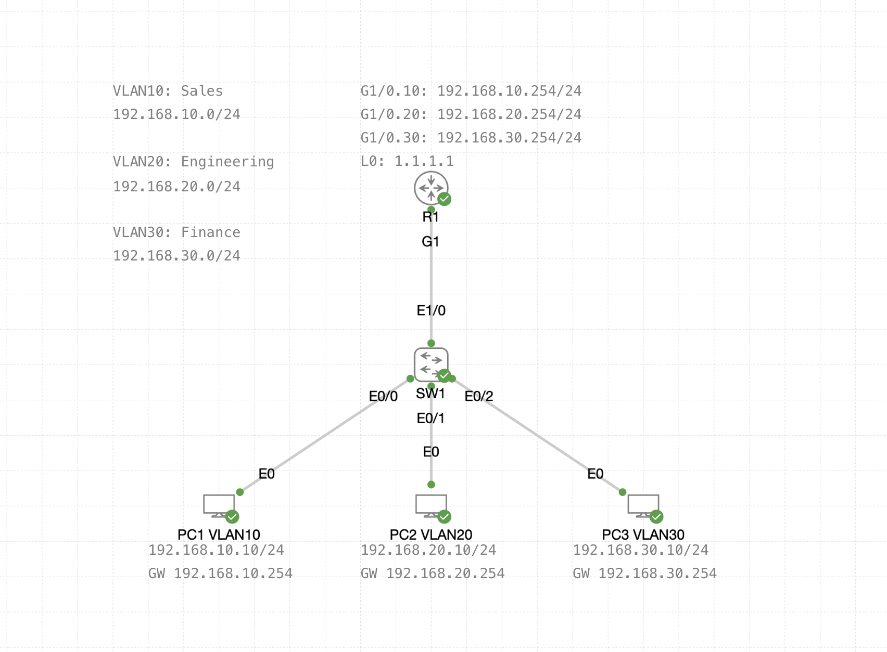

# VLANs and Router-on-a-Stick (RoaS) Lab

This lab demonstrates basic VLAN segmentation and inter-VLAN routing using Router-on-a-Stick — a common network design for small to mid-sized environments.

---

## Objectives

- Create and assign VLANs to switchports
- Enable trunking between switch and router
- Configure subinterfaces for inter-VLAN routing
- Verify end-to-end connectivity across VLANs

---

## Topology

---

## 📦 Network Details

| VLAN     | Name        | Subnet            | Gateway             |
|----------|-------------|-------------------|---------------------|
| VLAN 10  | Sales       | 192.168.10.0/24   | 192.168.10.254      |
| VLAN 20  | Engineering | 192.168.20.0/24   | 192.168.20.254      |
| VLAN 30  | Finance     | 192.168.30.0/24   | 192.168.30.254      |

---

## 🔧 Device Configurations

- [R1 (Router)](configs/R1.txt)
- [SW1 (Switch)](configs/SW1.txt)

---

## Test & Verification

- PCs on different VLANs can **ping** each other via router
- `show ip route` shows all 3 directly connected networks
- `show vlan brief` shows proper VLAN assignment
- `show interfaces trunk` confirms trunking is active

---

## Notes

This is the first lab in my network-focused GitHub portfolio. Each lab will include a topology diagram, config files, and clear documentation to demonstrate real-world networking skills.
